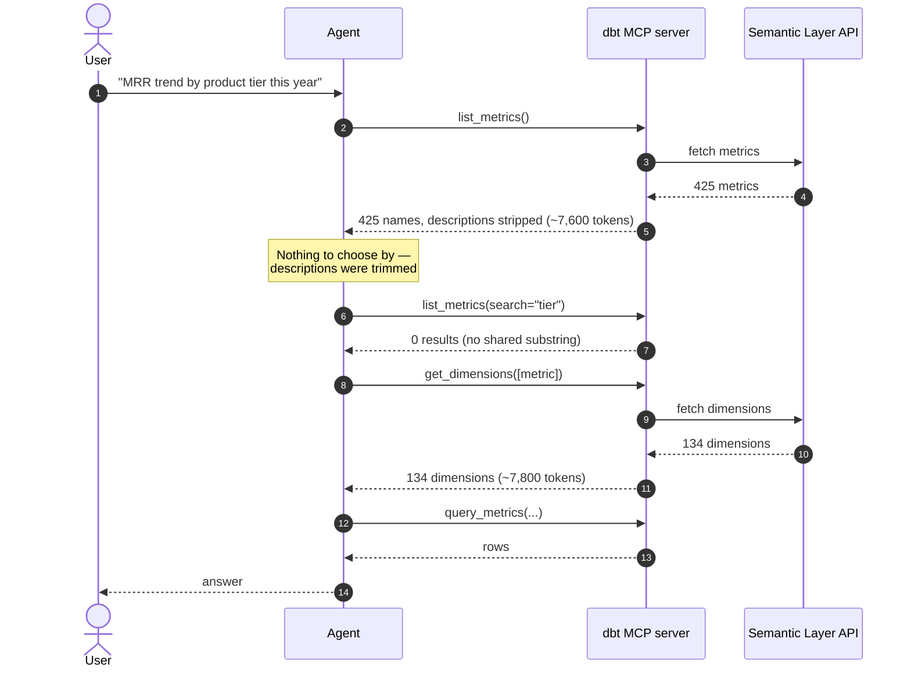
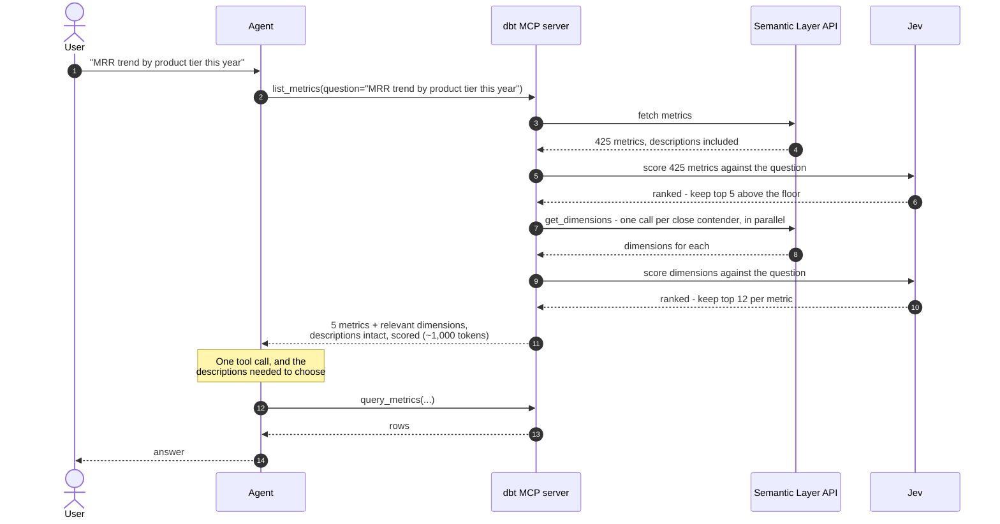
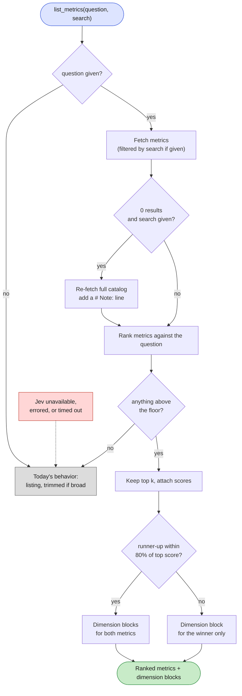

# Semantic relevance filtering for the dbt Semantic Layer (experimental)

Status: experimental, off by default. Enabled with `DBT_MCP_ENABLE_JEV`.

## The problem

An agent answering a data question has to find the right metric, then the right
dimensions, before it can query anything. On a real catalog that is expensive and
lossy.

Measured against a production project with 425 metrics:

| Step | Cost |
|---|---|
| `list_metrics()` | 30,360 chars (~7,600 tokens) |
| `get_dimensions([metric])` | 31,335 chars (~7,800 tokens), 134 dimensions |
| **Total before the first query** | **~15,400 tokens, 2 round trips** |

Worse, `list_metrics` is over its size budget, so it drops the `description` and
`metadata` columns for *every* metric. The agent receives 425 bare names. That matters
because catalogs are full of near-duplicates whose names differ by a suffix and whose
descriptions are the only thing that tells them apart:

```
revenue_churn                      All segments combined
revenue_churn_enterprise           Enterprise customers only
revenue_churn_self_serve           Self-serve customers only
revenue_churn_enterprise_adjusted  Enterprise, alternative calculation
```

(Names throughout this document are illustrative; the measurements behind them come
from a real catalog.)

The existing `search` parameter does not rescue this. It is a case-insensitive
substring match on the name, so a question phrased in business vocabulary finds
nothing: `search="product tier"` returns **zero** metrics, even though
`account__subscription_tier` exists.



## The approach

Add a `question` parameter to `list_metrics` carrying the user's question verbatim.
Score every metric against it with [Jev](https://docs.typesafe.ai) — a small model that
returns typed judgments rather than text — keep only the best matches, and return them
**with their full descriptions**, plus the dimensions that matter for them.

The key inversion: today the server trims *descriptions* to fit more items into the
budget. Here the server trims the *number of items* and keeps every description. Removing
descriptions is what destroys the agent's ability to choose.



Both goals come from one lever. Because dimensions travel back in the same response, the
separate `get_dimensions` call usually disappears — and because only a handful of metrics
survive, their descriptions fit comfortably in the budget.

### What it costs and saves

| | Before | After |
|---|---|---|
| Tokens before first query | ~15,400 | ~840–1,500 |
| Round trips | 2 | 1 |
| Descriptions available | no | yes |

Roughly 14,400 input tokens saved per question. What that is worth depends on the model
reading them:

| Model | Input $/1M | Catalog cost before | After (incl. ~$0.002 Jev) | Saved per question | Per 1,000 questions |
|---|---|---|---|---|---|
| Claude Sonnet 5 | $2.00 | $0.031 | $0.004 | **~$0.027** | ~$27 |
| Claude Opus 5 | $5.00 | $0.077 | $0.007 | **~$0.070** | ~$70 |

Two caveats that both point the same way — these figures are conservative:

- They count the catalog payload **once**. In an agent loop the tool result stays in the
  conversation and is re-sent on every subsequent turn, so the real saving is a multiple
  of the number above.
- They ignore output tokens and prompt caching, either of which shifts the arithmetic.

Jev itself bills input tokens only, at $42 per billion — about $0.002 per question, which
is why it barely registers against the model-side saving.

### Is the added latency actually added?

Not straightforwardly, and it would be misleading to present it as pure overhead.

Ranking costs 1.7–2.6s of wall clock. But the path it replaces is not free: today the
agent reads ~7,600 tokens of undifferentiated metric names, decides, makes a second
round trip, and reads ~7,800 more tokens of dimensions. That is model inference over
roughly 14,000 extra tokens plus a full extra round trip — and it is the agent's own
inference time, which is generally the slowest part of the loop.

So the honest comparison is Jev's 1.7–2.6s against the agent's inference on a much larger
prompt plus one more hop, not against zero. **Which is faster end to end has not been
measured in this codebase.** A prototype benchmark in a separate repository — different
harness, different questions — found the filtered path marginally *faster* overall
(~13s vs ~14s per question), but that is weak evidence for this implementation.

Settling it needs an end-to-end A/B through a real agent loop, measuring time to a correct
answer rather than time to a tool response. Until that exists, treat the 1.7–2.6s as a
known cost and the offsetting saving as plausible but unproven.

## How a call is resolved



Three behaviors worth calling out:

- **`search` and `question` compose.** `search` filters first; ranking happens among the
  survivors. `search` alone behaves exactly as it always has.
- **A `search` that matches nothing widens to the full catalog** rather than returning
  empty — this is precisely the case semantic ranking handles well — and says so in a
  `# Note:` line.
- **Every failure degrades to today's output.** Relevance filtering is an optimization;
  a TypeSafe outage, a timeout, or nothing clearing the relevance floor returns the
  ordinary listing rather than failing the tool call.

### Why runner-up metrics are gated

Ranking returns up to five metrics, but only the strongest get a dimension block, because
a block is expensive (12 dimensions with descriptions) and often redundant.

Consider "How many new accounts signed up last month, broken down by country?". The
ranking is:

```
0.95  new_signups             <- what was asked for
0.64  active_workspace_count  <- a different thing that also counts accounts
```

Without a gate, both get a dimension block. The second one looks useful in isolation —
its dimensions score highly (0.94, 0.93, …) — but that is an artifact: both metrics hang
off the same account model, so they expose nearly the same dimensions, and those
dimensions are scored against the same question. High scores on a block attached to the
wrong metric. The result is a response half full of near-duplicate rows that make the
agent's choice harder, not easier.

Gating on the *metric's* score fixes this, where gating on dimension scores would not.
A block is emitted only for metrics scoring at least 80% of the top score:

- `0.64 / 0.95 = 0.67` → below the bar, no block. Response drops from 6,028 to 3,349
  characters, and the remaining block unambiguously belongs to `new_signups`.
- For "What is our total revenue and how many active customers do we have?", the top two
  score 0.94 and 0.92 (`0.98` of the top) — genuinely two metrics, both keep their block.

Tune with `DBT_MCP_JEV_DIMENSION_SCORE_RATIO`; set it to `0` to always emit blocks up to
`DBT_MCP_JEV_DIMENSION_METRICS`.

## Enabling it

Both are required. Holding a TypeSafe key for unrelated reasons must not silently change
the tool schema or start sending catalog text off-host.

```bash
DBT_MCP_ENABLE_JEV=true
TYPESAFE_API_KEY=<your key>
```

Install with the optional extra:

```bash
uv sync --extra jev     # or: pip install 'dbt-mcp[jev]'
```

When disabled, `list_metrics` has no `question` parameter **in its schema at all** —
clients cannot see or send it — and behavior is byte-identical to before.

### Tuning

All optional, and none are exposed to the calling model.

| Variable | Default | Meaning |
|---|---|---|
| `DBT_MCP_JEV_TOP_K_METRICS` | `5` | Metrics kept after ranking |
| `DBT_MCP_JEV_TOP_K_DIMENSIONS` | `12` | Dimensions kept per block |
| `DBT_MCP_JEV_RELEVANCE_FLOOR` | `0.15` | Minimum score to be returned at all |
| `DBT_MCP_JEV_DIMENSION_METRICS` | `2` | Most dimension blocks in one response |
| `DBT_MCP_JEV_DIMENSION_SCORE_RATIO` | `0.8` | Runner-up's share of the top score needed to earn a block |
| `DBT_MCP_JEV_TIMEOUT` | `10.0` | Seconds before falling back to the plain listing |

Scores vary by roughly ±0.02 between runs, so top-k with a low floor is used rather than
an absolute cutoff.

### Observing cost

Jev's spend never appears in the calling agent's token accounting, so it is logged
server-side — one line per ranking call, at `INFO`:

```
jev.rank model=jev-1.13.0 kind=dimension candidates=236 selected=24 \
  input_tokens=13177 output_tokens=8436 usd=0.000553 latency_ms=504
```

Timeouts and errors log `latency_ms` too, since timing is most diagnostic when a call is
slow. Output tokens are free; only input tokens are billed.

**These go to stderr by default, which is lost when the server runs unattended.** To keep
them, turn on file logging:

```bash
DBT_MCP_SERVER_FILE_LOGGING=true
DBT_MCP_LOG_LEVEL=INFO            # default; the jev.rank lines are INFO
```

That writes `dbt-mcp.log` next to the installed package (the nearest ancestor directory
containing a `.git` or `pyproject.toml`, else your home directory). Both settings are
pre-existing dbt MCP server options, not specific to this feature. To total the spend:

```bash
grep 'jev.rank ' dbt-mcp.log | grep -o 'usd=[0-9.]*' | cut -d= -f2 \
  | awk '{s+=$1} END {printf "%d calls, $%.4f\n", NR, s}'
```

## Limitations

- **Single-project only.** The multi-project `list_metrics` in
  `semantic_layer/tools_multiproject.py` is unchanged.
- **Not every ranked metric gets a dimension block.** Dimensions are fetched with one
  `get_dimensions` call per metric, issued in parallel. (They have to be: the Semantic
  Layer API *intersects* dimensions when given several metrics at once, so a single
  multi-metric call returns almost nothing — for nine metrics it returned 249
  characters.) To bound that fan-out, blocks are produced for at most
  `DBT_MCP_JEV_DIMENSION_METRICS` metrics, and only for those within
  `DBT_MCP_JEV_DIMENSION_SCORE_RATIO` of the top score. Lower-ranked metrics are still
  listed and still carry their descriptions, but the agent must call `get_dimensions`
  itself if it picks one of them. Raise `DBT_MCP_JEV_DIMENSION_METRICS` to cover more
  of the ranked set, at one extra Semantic Layer call each.
- **Ranking quality depends on descriptions.** On a catalog whose metrics are
  undocumented, ranking degrades toward name matching. Measured on the near-duplicate
  revenue-churn family above, removing descriptions dropped top-1 accuracy from 5/6
  to 4/6.
- **Data leaves the host.** Metric and dimension names, their descriptions, and the end
  user's question are sent to TypeSafe. This is why the feature is opt-in.

  The question is *not* sent anywhere else. It is redacted from dbt's usage telemetry
  (`REDACT_ARGS` in `tracking/tracking.py`, alongside `sql_query` and `vars`), so the
  event records that a `question` was passed and how large it was, never its text. The
  local `jev.rank` log lines record counts and cost only, for the same reason. Both are
  covered by tests.
- **Latency is on the critical path**, 1.7–2.6s, dominated by ranking the full metric
  list.
